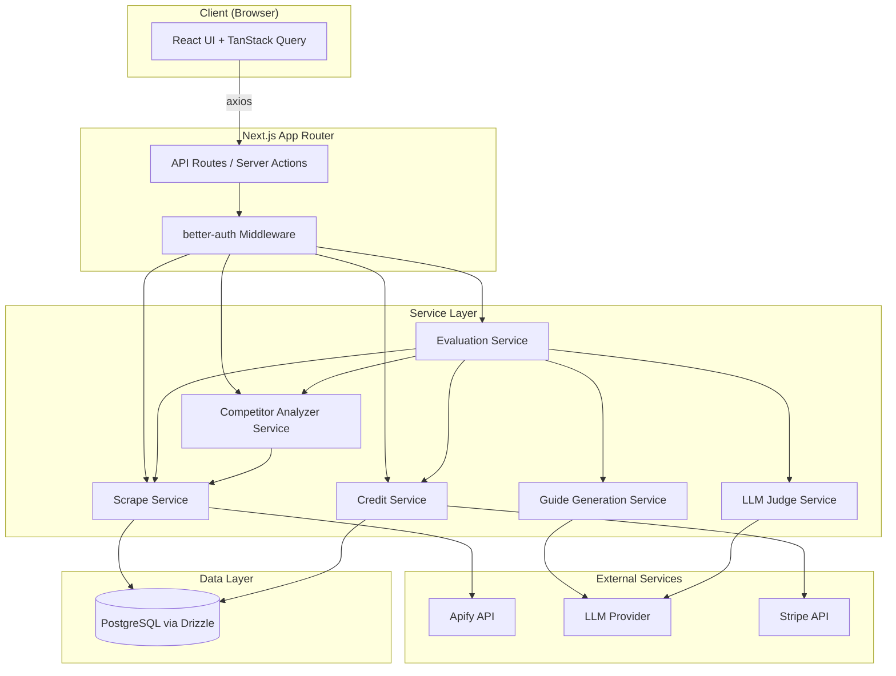
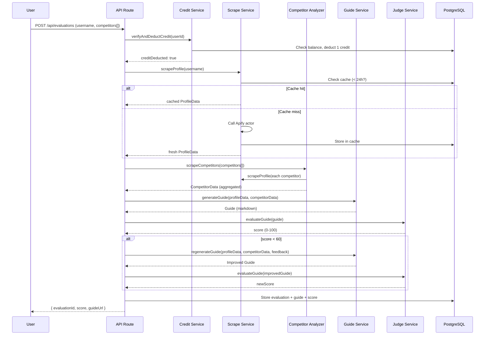

# Design Document: Instagram Profile Optimizer

## Overview

The Instagram Profile Optimizer is a Next.js web application that helps Brazilian businesses and creators improve their Instagram presence. The system follows a pipeline architecture: scrape user and competitor profiles via Apify, analyze them with a LangChain AI agent, quality-check the output with an LLM-as-Judge, and deliver a downloadable PDF guide. A credit-based payment system via Stripe gates access to evaluations.

The core flow is:

1. User authenticates → 2. Submits their Instagram username + 1–5 competitor usernames → 3. System scrapes profiles (cache-first, 24h TTL) → 4. AI Agent compares and generates a guide → 5. LLM Judge scores the guide (regenerate if < 60) → 6. User downloads PDF and views history on dashboard.

### Key Design Decisions

- **Cache-first scraping**: Apify calls are expensive and rate-limited. A 24h TTL Postgres cache avoids redundant scrapes.
- **LLM-as-Judge separation**: The quality evaluator uses a separate LLM call to ensure independent assessment of the generated guide.
- **Credit deduction before evaluation**: Credits are deducted optimistically at evaluation start, with refund logic on failure, to prevent double-spend in concurrent requests.
- **Server-side PDF generation**: Guides are generated as structured markdown by the AI agent and converted to PDF server-side to ensure consistent formatting.

## Architecture

The application follows a layered architecture within Next.js App Router:



### Request Flow for Profile Evaluation



## Components and Interfaces

### 1. Auth Module (`src/lib/auth/`)

Uses `better-auth` for session-based authentication.

```typescript
// src/lib/auth/index.ts
import { betterAuth } from "better-auth";
import { drizzleAdapter } from "better-auth/adapters/drizzle";

export const auth = betterAuth({
	database: drizzleAdapter(db, { provider: "pg" }),
	emailAndPassword: { enabled: true },
});
```

**Middleware**: Protects all `/dashboard` and `/api` routes (except `/api/auth/**` and `/api/webhooks/**`).

### 2. Scrape Service (`src/services/scrape-service.ts`)

```typescript
interface ScrapeService {
	scrapeProfile(username: string, forceRefresh?: boolean): Promise<ProfileData>;
}
```

- Checks `scrape_cache` table for a valid entry (< 24h old).
- On cache miss or `forceRefresh=true`, calls Apify's `apify/instagram-profile-scraper` actor via their REST API using axios.
- Normalizes the Apify response into the `ProfileData` schema.
- Stores/updates the cache entry.

### 3. Competitor Analyzer Service (`src/services/competitor-service.ts`)

```typescript
interface CompetitorService {
	analyzeCompetitors(usernames: string[]): Promise<CompetitorData>;
}
```

- Validates 1–5 usernames.
- Calls `ScrapeService.scrapeProfile()` for each competitor (uses `Promise.allSettled` to handle partial failures).
- Aggregates successful results into `CompetitorData`.
- Returns list of failed usernames alongside the aggregated data.

### 4. Guide Generation Service (`src/services/guide-service.ts`)

```typescript
interface GuideService {
	generateGuide(
		profile: ProfileData,
		competitors: CompetitorData,
	): Promise<GuideContent>;
	regenerateGuide(
		profile: ProfileData,
		competitors: CompetitorData,
		feedback: string,
	): Promise<GuideContent>;
	generatePdf(guide: GuideContent): Promise<Buffer>;
}
```

- Uses LangChain with a structured prompt chain.
- Evaluates: bio clarity, content strategy, posting consistency, value proposition, highlights/links usage.
- Outputs structured markdown that maps to the `GuideContent` type.
- PDF generation via a server-side library (e.g., `@react-pdf/renderer` or `puppeteer`).

### 5. LLM Judge Service (`src/services/judge-service.ts`)

```typescript
interface JudgeService {
	evaluateGuide(
		guide: GuideContent,
	): Promise<{ score: number; feedback: string }>;
}
```

- Makes a separate LLM call (independent from the guide generation model instance).
- Scores on completeness, actionability, and relevance (0–100).
- Returns structured feedback used for regeneration if score < 60.

### 6. Credit Service (`src/services/credit-service.ts`)

```typescript
interface CreditService {
	getBalance(userId: string): Promise<number>;
	deductCredit(
		userId: string,
	): Promise<{ success: boolean; newBalance: number }>;
	refundCredit(
		userId: string,
	): Promise<{ success: boolean; newBalance: number }>;
	createCheckoutSession(userId: string, quantity: number): Promise<string>; // returns Stripe checkout URL
	handleWebhook(event: Stripe.Event): Promise<void>;
}
```

- `deductCredit` uses a database transaction with row-level locking (`SELECT ... FOR UPDATE`) to prevent race conditions.
- Stripe Checkout Sessions for purchasing credits.
- Webhook handler for `checkout.session.completed` events to add credits.

### 7. Evaluation Service (`src/services/evaluation-service.ts`)

```typescript
interface EvaluationService {
	createEvaluation(
		userId: string,
		username: string,
		competitors: string[],
	): Promise<Evaluation>;
	getEvaluation(evaluationId: string): Promise<Evaluation>;
	listEvaluations(userId: string): Promise<Evaluation[]>;
}
```

- Orchestrates the full pipeline: credit check → scrape → analyze → generate → judge → store.
- Handles the regeneration loop (max 1 retry if score < 60).
- On failure after credit deduction, calls `CreditService.refundCredit()`.

### 8. API Routes

| Route                       | Method | Description                    |
| --------------------------- | ------ | ------------------------------ |
| `/api/auth/**`              | \*     | better-auth handler            |
| `/api/evaluations`          | POST   | Create new evaluation          |
| `/api/evaluations`          | GET    | List user's evaluations        |
| `/api/evaluations/[id]`     | GET    | Get evaluation details         |
| `/api/evaluations/[id]/pdf` | GET    | Download guide PDF             |
| `/api/credits/balance`      | GET    | Get credit balance             |
| `/api/credits/checkout`     | POST   | Create Stripe checkout session |
| `/api/webhooks/stripe`      | POST   | Stripe webhook handler         |

### 9. Client Pages

| Route                         | Description                                        |
| ----------------------------- | -------------------------------------------------- |
| `/login`                      | Login/signup page                                  |
| `/dashboard`                  | Credit balance + evaluation history                |
| `/dashboard/evaluate`         | Multistep evaluation form (username + competitors) |
| `/dashboard/evaluations/[id]` | Evaluation result + PDF download                   |

### 10. Multistep Evaluation Form (`/dashboard/evaluate`)

The evaluation creation flow uses a multistep form with 3 steps and a progress indicator. Form state is managed client-side with React state (no URL-based steps). Each step validates before allowing progression to the next.

**Step 1 — Your Profile**

- Input: Instagram username (text field with `@` prefix display)
- Validation: required, 1–30 chars, matches `/^[a-zA-Z0-9._]+$/`
- On "Next": validates the username format before proceeding

**Step 2 — Competitor Profiles**

- Input: Dynamic list of competitor username fields (1–5)
- "Add competitor" button (disabled when 5 reached)
- "Remove" button per competitor (disabled when only 1 remains)
- Validation: each username follows same rules as Step 1, at least 1 required, max 5
- On "Next": validates all competitor usernames

**Step 3 — Review & Confirm**

- Displays summary: user's username + list of competitor usernames
- Shows credit cost (1 credit) and current balance
- If insufficient credits: shows "Buy Credits" button instead of "Start Evaluation"
- "Start Evaluation" button submits the form via `POST /api/evaluations`
- On submit: shows loading state, then redirects to `/dashboard/evaluations/[id]` on success

**Form UX Details:**

- Step progress indicator at the top (e.g., "Step 1 of 3 — Your Profile")
- "Back" button on steps 2 and 3 to return to previous step (preserves entered data)
- All form state preserved when navigating between steps
- Form submission disabled while API call is in progress

## Data Models

Using Drizzle ORM with PostgreSQL. All tables use UUIDs as primary keys.

```typescript
// src/db/schema.ts
import {
	pgTable,
	uuid,
	text,
	integer,
	timestamp,
	jsonb,
	varchar,
} from "drizzle-orm/pg-core";

// better-auth manages its own user/session tables.
// We reference the user ID from better-auth's user table.

export const credits = pgTable("credits", {
	id: uuid("id").defaultRandom().primaryKey(),
	userId: text("user_id").notNull(),
	balance: integer("balance").notNull().default(0),
	updatedAt: timestamp("updated_at").defaultNow().notNull(),
});

export const scrapeCache = pgTable("scrape_cache", {
	id: uuid("id").defaultRandom().primaryKey(),
	username: varchar("username", { length: 255 }).notNull().unique(),
	profileData: jsonb("profile_data").notNull().$type<ProfileData>(),
	scrapedAt: timestamp("scraped_at").defaultNow().notNull(),
	updatedAt: timestamp("updated_at").defaultNow().notNull(),
});

export const evaluations = pgTable("evaluations", {
	id: uuid("id").defaultRandom().primaryKey(),
	userId: text("user_id").notNull(),
	username: varchar("username", { length: 255 }).notNull(),
	competitors: jsonb("competitors").notNull().$type<string[]>(),
	guideContent: jsonb("guide_content").$type<GuideContent>(),
	qualityScore: integer("quality_score"),
	status: varchar("status", { length: 50 }).notNull().default("pending"),
	// status: "pending" | "scraping" | "analyzing" | "generating" | "judging" | "completed" | "failed"
	createdAt: timestamp("created_at").defaultNow().notNull(),
	updatedAt: timestamp("updated_at").defaultNow().notNull(),
});

export const creditTransactions = pgTable("credit_transactions", {
	id: uuid("id").defaultRandom().primaryKey(),
	userId: text("user_id").notNull(),
	amount: integer("amount").notNull(), // positive = purchase, negative = deduction
	type: varchar("type", { length: 50 }).notNull(), // "purchase" | "deduction" | "refund"
	referenceId: text("reference_id"), // Stripe session ID or evaluation ID
	createdAt: timestamp("created_at").defaultNow().notNull(),
});
```

### TypeScript Interfaces

```typescript
// src/types/index.ts

export interface ProfileData {
	username: string;
	bio: string;
	followerCount: number;
	followingCount: number;
	postCount: number;
	posts: PostData[];
	averageLikes: number;
	averageComments: number;
	engagementRate: number;
	postingFrequency: number; // posts per week
	topHashtags: string[];
	scrapedAt: string; // ISO timestamp
}

export interface PostData {
	caption: string;
	likes: number;
	comments: number;
	hashtags: string[];
	timestamp: string;
	type: "image" | "video" | "carousel";
}

export interface CompetitorData {
	competitors: Array<{
		username: string;
		profileData: ProfileData;
	}>;
	aggregated: {
		averageFollowers: number;
		averageEngagementRate: number;
		averagePostingFrequency: number;
		commonHashtags: string[];
		bioPatterns: string[];
		contentTypeMix: { image: number; video: number; carousel: number };
	};
	failedUsernames: string[];
}

export interface GuideContent {
	summary: string;
	weaknesses: Array<{
		area: string;
		description: string;
		severity: "high" | "medium" | "low";
	}>;
	recommendations: Array<{
		criterion: string; // bio, content, posting, value_proposition, highlights
		currentState: string;
		recommendation: string;
		priority: number;
	}>;
	taskList: Array<{
		task: string;
		priority: number;
		estimatedImpact: "high" | "medium" | "low";
	}>;
}

export interface Evaluation {
	id: string;
	userId: string;
	username: string;
	competitors: string[];
	guideContent: GuideContent | null;
	qualityScore: number | null;
	status:
		| "pending"
		| "scraping"
		| "analyzing"
		| "generating"
		| "judging"
		| "completed"
		| "failed";
	createdAt: string;
}
```

## Correctness Properties

_A property is a characteristic or behavior that should hold true across all valid executions of a system — essentially, a formal statement about what the system should do. Properties serve as the bridge between human-readable specifications and machine-verifiable correctness guarantees._

### Property 1: Invalid credentials produce uniform error messages

_For any_ authentication attempt with invalid credentials (wrong email, wrong password, or both), the error response should be identical and should not reveal whether the email exists or the password was incorrect.

**Validates: Requirements 1.3**

### Property 2: Protected route redirect

_For any_ protected route in the application, an unauthenticated request (no session) should result in a redirect to the login page.

**Validates: Requirements 1.4**

### Property 3: Scrape cache round trip

_For any_ Instagram username that is successfully scraped, storing the ProfileData in the cache and then querying the cache for that username should return an equivalent ProfileData object with a valid timestamp.

**Validates: Requirements 2.2, 3.5, 7.1, 7.4**

### Property 4: Cache freshness resolution

_For any_ username with a cached entry, if the cache entry is less than 24 hours old, the scrape service should return the cached data; if the cache entry is 24 hours or older, the scrape service should perform a fresh scrape and return new data.

**Validates: Requirements 2.4, 7.2**

### Property 5: Force refresh bypasses cache

_For any_ username with a valid (non-expired) cached entry, requesting a scrape with `forceRefresh=true` should return data with a `scrapedAt` timestamp newer than the previously cached entry.

**Validates: Requirements 7.3**

### Property 6: Invalid username error handling

_For any_ invalid or non-existent Instagram username, the scrape service should return an error result (not throw an unhandled exception) containing a descriptive message.

**Validates: Requirements 2.5**

### Property 7: ProfileData structural completeness

_For any_ ProfileData object returned by the scrape service, it must contain all required fields: bio (string), username (string), posts (array with captions), hashtags, engagement metrics (likes, comments), follower count, following count, and posting frequency.

**Validates: Requirements 2.6**

### Property 8: Competitor aggregation correctness

_For any_ set of 1–5 valid ProfileData objects, the Competitor Analyzer's aggregation should produce a CompetitorData object where: `averageFollowers` equals the mean of all follower counts, `averageEngagementRate` equals the mean of all engagement rates, `averagePostingFrequency` equals the mean of all posting frequencies, and `commonHashtags` is a subset of the union of all hashtags.

**Validates: Requirements 3.2**

### Property 9: Competitor count validation

_For any_ list of competitor usernames, the system should accept lists of length 1 to 5 and reject lists of length 0 or greater than 5 with a validation error.

**Validates: Requirements 3.3**

### Property 10: Partial competitor failure handling

_For any_ mix of valid and invalid competitor usernames, the CompetitorData result should contain ProfileData for all valid usernames and list all invalid usernames in the `failedUsernames` array.

**Validates: Requirements 3.4**

### Property 11: Guide structural completeness

_For any_ generated Guide, it must contain: a non-empty summary, at least one weakness entry, recommendations covering all five evaluation criteria (bio, content strategy, posting consistency, value proposition, highlights/links), and a non-empty prioritized task list.

**Validates: Requirements 4.2, 4.3**

### Property 12: PDF generation produces valid output

_For any_ valid GuideContent object, the PDF generator should produce a non-empty Buffer that starts with the PDF magic bytes (`%PDF`).

**Validates: Requirements 4.4**

### Property 13: Failed evaluation triggers credit refund

_For any_ evaluation where the AI Agent fails to generate a guide, the user's credit balance after the failure should equal their balance before the evaluation was initiated (i.e., the deducted credit is refunded).

**Validates: Requirements 4.5**

### Property 14: Judge score range invariant

_For any_ guide evaluation by the LLM Judge, the returned quality score must be an integer in the range [0, 100].

**Validates: Requirements 5.2**

### Property 15: Low score triggers regeneration

_For any_ evaluation where the LLM Judge assigns a score below 60, the system should invoke guide regeneration exactly once before storing the final result.

**Validates: Requirements 5.3**

### Property 16: Score persistence

_For any_ completed evaluation, the stored database record must contain both the guide content and the quality score (neither null).

**Validates: Requirements 5.5**

### Property 17: Credit deduction is exactly one per evaluation

_For any_ successful evaluation, the user's credit balance should decrease by exactly 1 compared to their balance before the evaluation.

**Validates: Requirements 6.1, 6.8**

### Property 18: Credit balance reflects Stripe events

_For any_ Stripe `checkout.session.completed` webhook event with quantity N, the user's credit balance should increase by exactly N. For any failed payment event, the balance should remain unchanged.

**Validates: Requirements 6.4, 6.5**

### Property 19: Insufficient credits blocks evaluation

_For any_ user with 0 credits, attempting to create an evaluation should fail with an insufficient credits error and the evaluation should not be started.

**Validates: Requirements 6.6, 6.7**

### Property 20: Evaluation history ordering and completeness

_For any_ user with multiple completed evaluations, the list returned by the evaluation history endpoint should be sorted in reverse chronological order (newest first), and each entry should contain a date and quality score.

**Validates: Requirements 8.2, 8.4**

### Property 21: Past evaluation PDF download

_For any_ completed evaluation in the system, requesting the PDF download should return a valid PDF document matching the stored guide content.

**Validates: Requirements 8.3**

## Error Handling

### External Service Failures

| Service      | Failure Mode              | Handling Strategy                                                                          |
| ------------ | ------------------------- | ------------------------------------------------------------------------------------------ |
| Apify        | API timeout / rate limit  | Retry with exponential backoff (max 3 attempts). Return descriptive error to user.         |
| Apify        | Invalid username          | Return structured error with the invalid username. No retry.                               |
| LLM Provider | API timeout / error       | Retry once. On second failure, refund credit and mark evaluation as failed.                |
| LLM Provider | Malformed response        | Parse with Zod schema validation. On parse failure, retry once with stricter prompt.       |
| Stripe       | Checkout creation failure | Return error to user. No credit change.                                                    |
| Stripe       | Webhook delivery failure  | Stripe retries automatically. Idempotent webhook handler (check if credits already added). |

### Application-Level Errors

- **Concurrent credit deduction**: Use `SELECT ... FOR UPDATE` row-level locking in a transaction to prevent race conditions.
- **Evaluation pipeline failure**: Any failure after credit deduction triggers `CreditService.refundCredit()`. Evaluation status set to `"failed"`.
- **Cache corruption**: If cached ProfileData fails Zod validation on read, treat as cache miss and re-scrape.
- **Regeneration loop**: Maximum 1 regeneration attempt. If the second guide also scores below 60, store it anyway with the score and mark as completed (user still gets a guide, just lower quality).

### Validation

All API inputs validated with Zod schemas:

```typescript
// Example: evaluation creation
const createEvaluationSchema = z.object({
	username: z
		.string()
		.min(1)
		.max(30)
		.regex(/^[a-zA-Z0-9._]+$/),
	competitors: z
		.array(
			z
				.string()
				.min(1)
				.max(30)
				.regex(/^[a-zA-Z0-9._]+$/),
		)
		.min(1)
		.max(5),
});
```

## Testing Strategy

### Unit Tests

Unit tests cover specific examples, edge cases, and error conditions:

- Auth: login with valid credentials, login with wrong password, access protected route without session
- Scrape Service: successful scrape stores in cache, invalid username returns error, Apify response normalization
- Competitor Analyzer: aggregate 3 valid profiles, handle 2 valid + 1 invalid, reject 0 competitors, reject 6 competitors
- Credit Service: deduct from balance of 1, deduct from balance of 0, refund after failure, concurrent deduction safety
- Guide Service: PDF generation from valid GuideContent, PDF generation from minimal GuideContent
- Judge Service: parse valid score response, handle malformed LLM response
- Evaluation Service: full pipeline happy path (mocked services), pipeline failure triggers refund
- Dashboard: evaluation history returns correct order, empty history returns empty array

### Property-Based Tests

Property-based tests use `fast-check` (TypeScript PBT library) with a minimum of 100 iterations per test.

Each property test references its design document property with a comment tag:

```typescript
// Feature: instagram-profile-optimizer, Property 8: Competitor aggregation correctness
test("aggregation computes correct averages", () => {
	fc.assert(
		fc.property(
			fc.array(profileDataArbitrary, { minLength: 1, maxLength: 5 }),
			(profiles) => {
				const result = aggregateCompetitors(profiles);
				const expectedAvgFollowers =
					profiles.reduce((s, p) => s + p.followerCount, 0) / profiles.length;
				expect(result.aggregated.averageFollowers).toBeCloseTo(
					expectedAvgFollowers,
				);
			},
		),
		{ numRuns: 100 },
	);
});
```

Properties to implement as `fast-check` property tests:

| Property                        | Test Focus           | Generator Strategy                                                     |
| ------------------------------- | -------------------- | ---------------------------------------------------------------------- |
| 1: Uniform error messages       | Auth error responses | Generate random email/password combos with various invalid states      |
| 2: Protected route redirect     | Route protection     | Generate from list of all protected routes                             |
| 3: Scrape cache round trip      | Cache persistence    | Generate random ProfileData objects                                    |
| 4: Cache freshness resolution   | TTL logic            | Generate random timestamps relative to now (before/after 24h boundary) |
| 5: Force refresh bypasses cache | Cache bypass         | Generate random cached entries with various ages                       |
| 6: Invalid username error       | Error handling       | Generate strings with invalid Instagram username characters            |
| 7: ProfileData completeness     | Schema validation    | Generate random Apify API responses                                    |
| 8: Competitor aggregation       | Math correctness     | Generate arrays of 1-5 random ProfileData objects                      |
| 9: Competitor count validation  | Input validation     | Generate arrays of random lengths (0-10)                               |
| 10: Partial failure handling    | Resilience           | Generate mixed arrays of valid/invalid usernames                       |
| 11: Guide completeness          | Structure validation | Generate random GuideContent objects                                   |
| 12: PDF generation              | Output validation    | Generate random GuideContent objects                                   |
| 13: Failed eval refund          | Credit integrity     | Generate random initial balances and failure scenarios                 |
| 14: Score range invariant       | Output bounds        | Generate random guide evaluations                                      |
| 15: Low score regeneration      | Orchestration        | Generate random scores (0-100) and verify regeneration trigger         |
| 16: Score persistence           | Data integrity       | Generate random completed evaluations                                  |
| 17: Credit deduction            | Balance math         | Generate random initial balances (1-100)                               |
| 18: Stripe event handling       | Webhook processing   | Generate random Stripe events with various quantities                  |
| 19: Insufficient credits        | Guard logic          | Generate evaluation requests with 0-balance users                      |
| 20: History ordering            | Sort invariant       | Generate random lists of evaluations with various timestamps           |
| 21: PDF download                | Retrieval            | Generate random completed evaluations with guide content               |

### Test Configuration

- Framework: Vitest
- PBT Library: `fast-check`
- Minimum iterations: 100 per property test
- Mocking: External services (Apify, LLM, Stripe) mocked in all tests
- Database: Use in-memory SQLite or test PostgreSQL container for integration tests
